# 📞 Marchel - Central Telefónica VoIP con Asterisk

<div align="center">


[](https://www.asterisk.org/)
[-blueviolet.svg)](https://wiki.asterisk.org/wiki/display/AST/PJSIP+Configuration+Wizard)
[](https://mariadb.org/)
[](https://flask.palletsprojects.com/)
[](http://www.cstr.ed.ac.uk/projects/festival/)
[](https://es.wikipedia.org/wiki/Voz_sobre_protocolo_de_internet)
[](https://www.uah.es/)

### 📬 Contacto
<table align="center">
  <tr>
    <td align="center">
      <strong>Marcos Santos Aragón</strong>
    </td>
    <td align="center">
      <strong>Chelsea Fernández Hernández</strong>
    </td>
  </tr>
  <tr>
    <td align="center">
      <a href="https://www.linkedin.com/in/marcos-santos-aragón/" target="_blank">
        
      </a>
      &nbsp;&nbsp;
      <a href="mailto:marcos.santos.aragon@gmail.com" target="_blank">
        
      </a>
      &nbsp;&nbsp;
      <a href="https://github.com/MarcosSAuah" target="_blank">
        
      </a>
    </td>
    <td align="center">
      <a href="https://www.linkedin.com/in/chelsea-fernandez-hernandez-64a339189/" target="_blank">
        
      </a>
      &nbsp;&nbsp;
      <a href="mailto:chelseafh2003@gmail.com" target="_blank">
        
      </a>
      &nbsp;&nbsp;
      <a href="https://github.com/Chelseafh" target="_blank">
        
      </a>
    </td>
  </tr>
</table>
</div>

---

**Marchel** es una central telefónica completa (PBX) basada en Asterisk, desarrollada como proyecto académico en la **Universidad Politécnica de Alcalá de Henares** para la asignatura *Laboratorio de Redes, Señales y Sistemas*.

Este proyecto implementa un sistema de telefonía IP (VoIP) completo con funcionalidades avanzadas como menús IVR, colas de llamadas, buzón de voz, conferencias, sistema de tarificación y una interfaz web de gestión.

## 📘 Introducción

Esta práctica fue desarrollada por dos estudiantes (los autores indicados en este repositorio) como proyecto de la asignatura *Laboratorio de Redes, Señales y Sistemas*. La implementación se realizó sobre una máquina virtual Ubuntu en VirtualBox, utilizando conectividad en modo *bridge* para facilitar la integración de red con el entorno local y las pruebas de telefonía IP entre dispositivos/softphones.

Durante el desarrollo se trabajó con comandos de administración y transferencia remota como `ssh` y `scp` para configuración y despliegue. Para agilizar la operativa y reducir el uso manual continuo de consola, también se utilizó MobaXterm (Moba), centralizando sesiones remotas y transferencia de archivos en un mismo entorno.

Esta guía mantiene el orden de la memoria PDF del proyecto para conservar coherencia entre ambos documentos en nombres de apartados, secuencia de explicación y alcance funcional.

---

## 📋 Tabla de Contenidos

- **Contenido principal**
  - [Introducción](#-introducción)
  - [Desarrollo de Guía](#-desarrollo-de-guía)
    - [Instalación de Asterisk](#1-instalación-de-asterisk)
    - [Creación de Usuarios](#2-creación-de-usuarios)
      - [Zoiper](#3-zoiper)
    - [Configuración del Idioma](#4-configuración-del-idioma)
    - [Funcionalidades](#funcionalidades)
      - [Buzón de Voz](#buzón-de-voz)
      - [Música en Espera](#música-en-espera)
      - [Transferencias](#transferencias)
      - [Conferencias](#conferencias)
      - [Texto a Voz - TTS](#texto-a-voz---tts)
        - [Festival](#festival)
      - [Menú IVR](#menú-ivr)
      - [Llamadas en Cola](#llamadas-en-cola)
      - [Conexión PBXs](#conexión-pbxs)
      - [Instalación de MariaDB](#instalación-de-mariadb)
      - [Tarificación](#tarificación)
        - [www.marchel.com](#wwwmarchelcom)
  - [Conclusión](#-conclusión)
  - [Bibliografía](#-bibliografía)

- **Mejoras y apartados añadidos**
  - [Características](#-características)
  - [Estructura del Repositorio](#-estructura-del-repositorio)
  - [Requisitos del Sistema](#-requisitos-del-sistema)
  - [Grabación de Llamadas](#grabación-de-llamadas)
  - [Anexo: Zoiper (detalle)](#-anexo-zoiper-detalle)
    - [Descargar Zoiper](#descargar-zoiper)
    - [Configurar usuario](#configurar-usuario)
    - [Realizar llamadas](#realizar-llamadas)
  - [Mapa de imágenes (auditoría)](#-mapa-de-imágenes-auditoría)
  - [Arquitectura del Sistema](#-arquitectura-del-sistema)
  - [Contribuciones y Sugerencias](#-contribuciones-y-sugerencias)
    - [Contacto](#-contacto)
  - [Autores](#-autores)
  - [Licencia](#-licencia)
  - [Agradecimientos](#-agradecimientos)
  - [Notas Adicionales](#-notas-adicionales)
    - [Comandos útiles de Asterisk](#comandos-útiles-de-asterisk)
    - [Solución de problemas comunes](#solución-de-problemas-comunes)

---

## 🧪 Mejoras y apartados añadidos

Los apartados siguientes se mantienen como documentación técnica adicional para facilitar despliegue, mantenimiento y uso del repositorio.

## ✨ Características

- **📱 Sistema VoIP completo** basado en Asterisk con protocolo PJSIP
- **👥 Gestión de usuarios** con extensiones personalizadas (2XXX)
- **📧 Buzón de voz** con mensajes personalizados
- **🎵 Música en espera** configurable
- **🔄 Transferencias de llamadas** (ciegas y asistidas)
- **🎤 Conferencias** tipo Discord con control de administrador
- **🗣️ Text-to-Speech** con Festival (voces en español)
- **🎙️ Grabación de llamadas** automática y bajo demanda
- **📞 Menú IVR** para atención al cliente
- **⏰ Colas de llamadas** para soporte técnico
- **🔗 Conexión entre PBXs** mediante troncales PJSIP
- **💾 Base de datos MariaDB** para registro de llamadas (CDR)
- **💰 Sistema de tarificación** automático
- **🌐 Interfaz web** con Flask para estadísticas y gestión
- **🌍 Soporte multiidioma** (español configurado)

---

## 🗂️ Estructura del Repositorio

```text
.
├── app/
│   └── web/                  # Aplicación Flask
├── assets/
│   └── readme/               # Imágenes usadas por este README
├── config/
│   ├── asterisk/             # Archivos .conf de Asterisk
│   └── odbc/                 # Configuración ODBC
├── database/
│   ├── schema.sql            # Esquema base de MariaDB
│   └── seed_tarifas.sql      # Tarifas iniciales de ejemplo
├── docs/
│   ├── legacy/               # Notas originales de trabajo
│   ├── presentation/         # Presentación de la práctica
│   └── report/               # Memoria y capturas
├── scripts/                  # Scripts auxiliares de tarificación
├── .env.example              # Variables de entorno de ejemplo
├── .gitignore
├── README.md
└── requirements.txt
```

---

## 🖥️ Requisitos del Sistema

- **Sistema Operativo**: Ubuntu 24.04 LTS (recomendado)
- **RAM**: Mínimo 2GB (4GB recomendado)
- **Disco**: 20GB libres
- **Asterisk**: Versión 20 o superior (para soporte PJSIP)
- **MariaDB**: Versión 10.x o superior
- **Python**: 3.8 o superior (para scripts de tarificación y web)
- **Festival**: Para síntesis de voz (TTS)

---

## 🧭 Desarrollo de Guía

> Nota: En esta guía se usan nombres de imágenes y apartados alineados con la memoria PDF (`docs/report/memoria-guia-completa-con-imagenes.pdf`) para facilitar el seguimiento entre ambos documentos.

### 1. Instalación de Asterisk

#### Actualizar el sistema

```bash
sudo apt update && sudo apt upgrade -y
```

#### Instalar dependencias necesarias

```bash
sudo apt install -y build-essential wget libssl-dev libncurses5-dev \
libnewt-dev libxml2-dev linux-headers-$(uname -r) libsqlite3-dev \
uuid-dev libjansson-dev libedit-dev
```

#### Descargar Asterisk

Descarga la versión más reciente desde [https://downloads.asterisk.org/pub/telephony/asterisk/](https://downloads.asterisk.org/pub/telephony/asterisk/)

```bash
cd /usr/src
sudo wget https://downloads.asterisk.org/pub/telephony/asterisk/asterisk-20-current.tar.gz
sudo tar -xvzf asterisk-20-current.tar.gz
cd asterisk-20*/
```

#### Instalar dependencias adicionales

```bash
sudo contrib/scripts/get_mp3_source.sh
sudo contrib/scripts/install_prereq install
```

#### Configurar Asterisk

```bash
sudo ./configure
```

Asegúrate de habilitar los módulos necesarios:

```bash
sudo make menuselect
```

En el menú, verifica que estén habilitados:
- **Add-ons**: `res_config_mysql`, `cdr_mysql`
- **Resource Modules**: `res_odbc`, `res_config_odbc`
- **Applications**: `app_festival`

Guarda y sal con `Save & Exit`.

<a id="img-01"></a>

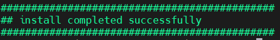

<a id="img-02"></a>

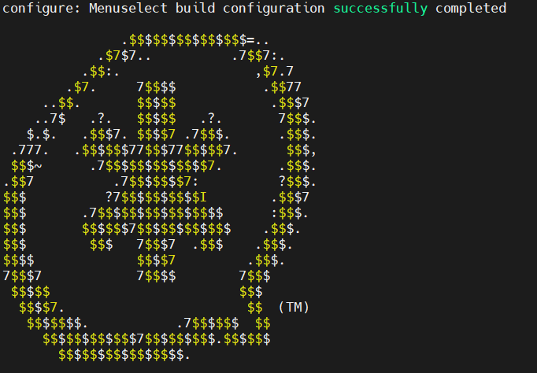

<a id="img-03"></a>

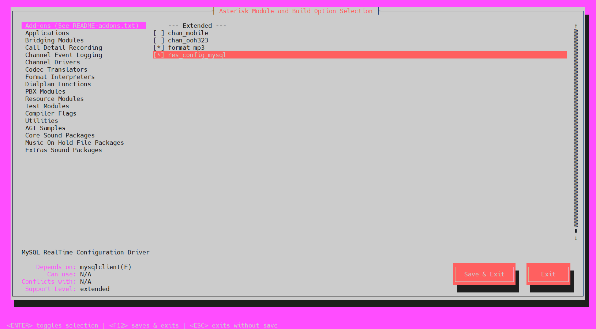

<a id="img-04"></a>

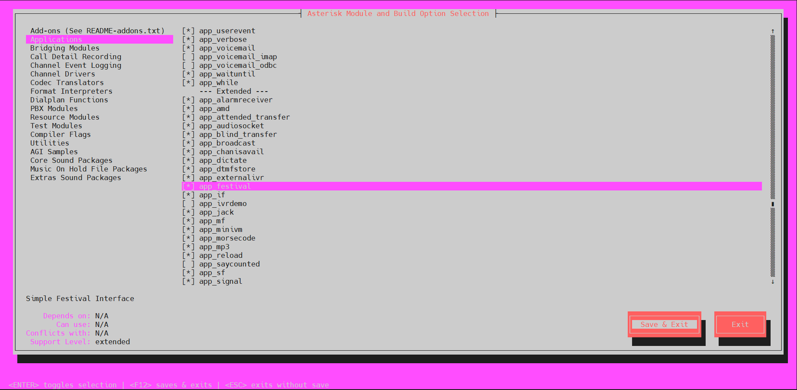

<a id="img-05"></a>

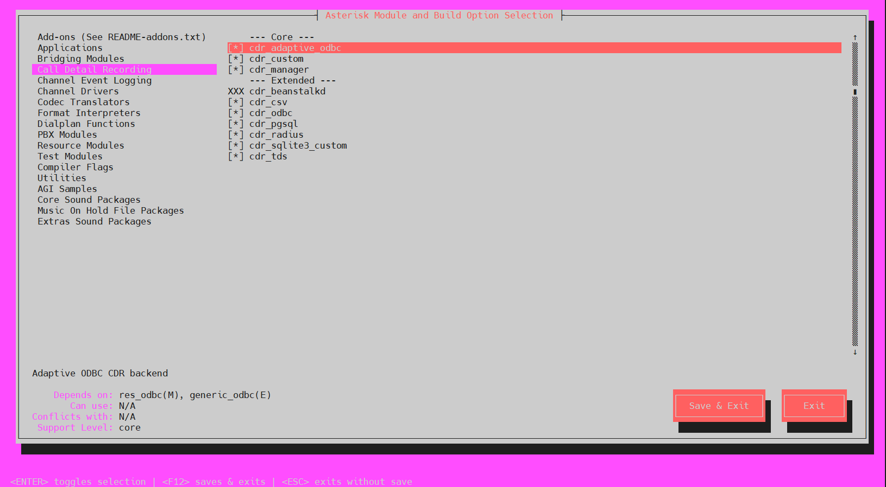

<a id="img-06"></a>

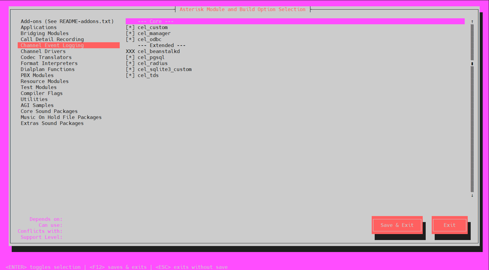

<a id="img-07"></a>

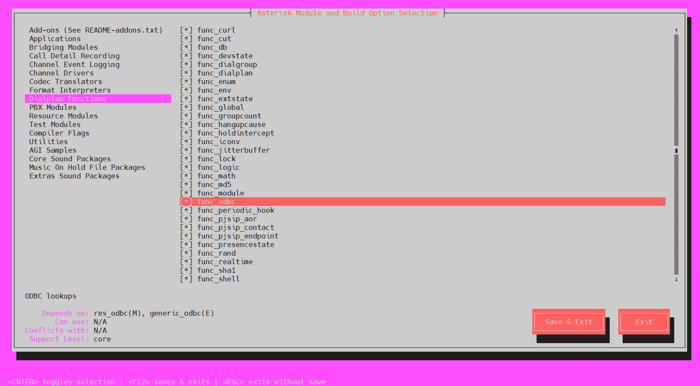

<a id="img-08"></a>

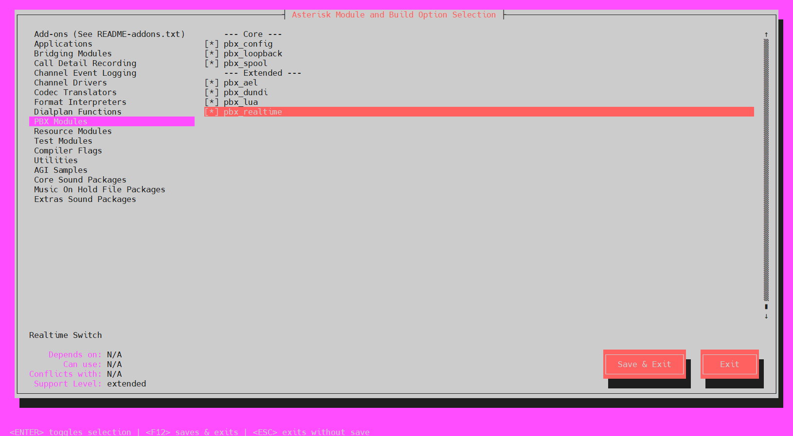

<a id="img-09"></a>

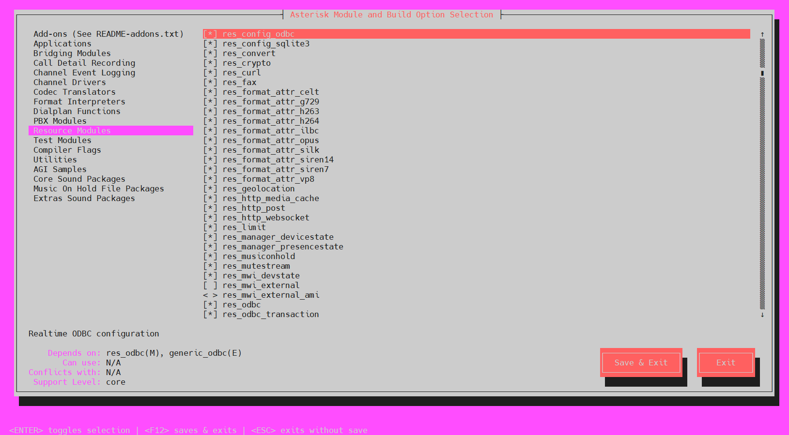

<a id="img-10"></a>

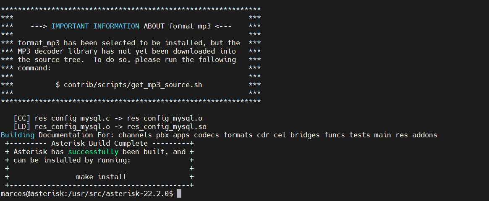

<a id="img-11"></a>

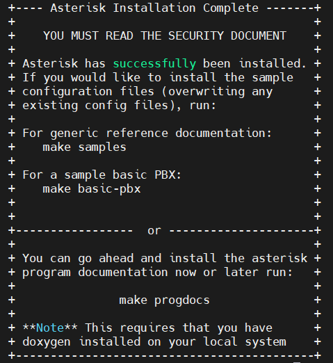

<a id="img-12"></a>

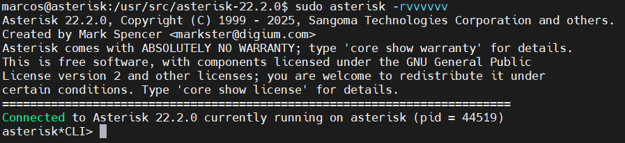

#### Compilar e instalar

```bash
sudo make -j$(nproc)
sudo make install
sudo make samples
sudo make config
```

#### Crear usuario y grupo Asterisk

```bash
sudo groupadd asterisk
sudo useradd -r -d /var/lib/asterisk -g asterisk asterisk
sudo usermod -aG audio,dialout asterisk
```

#### Configurar permisos

Edita `/etc/default/asterisk` y descomenta:

```bash
AST_USER="asterisk"
AST_GROUP="asterisk"
```

Asigna permisos:

```bash
sudo chown -R asterisk:asterisk /etc/asterisk
sudo chown -R asterisk:asterisk /var/{lib,log,spool}/asterisk
sudo chown -R asterisk:asterisk /usr/lib/asterisk
```

#### Iniciar Asterisk

```bash
sudo systemctl daemon-reload
sudo systemctl enable asterisk
sudo systemctl start asterisk
sudo systemctl status asterisk
```

Accede a la consola de Asterisk:

```bash
sudo asterisk -rvvv
```

#### Configurar el Firewall

Abre los puertos necesarios para que Asterisk funcione correctamente:

```bash
# Puerto SIP/PJSIP (señalización)
sudo ufw allow 5060/udp

# Rango de puertos RTP (audio)
sudo ufw allow 10000:20000/udp

# Puerto web (si usas la interfaz Flask)
sudo ufw allow 5000/tcp

sudo ufw reload
sudo ufw status
```

> **Nota**: El rango de puertos RTP (10000–20000) debe coincidir con lo configurado en `/etc/asterisk/rtp.conf`. Si no existe, se puede crear con:
> ```ini
> [general]
> rtpstart=10000
> rtpend=20000
> ```

### 2. Creación de Usuarios

#### Editar `/etc/asterisk/pjsip.conf`

Configura el protocolo de transporte UDP:

```ini
[transport-udp]
type=transport
protocol=udp
bind=0.0.0.0
```

<a id="img-13"></a>

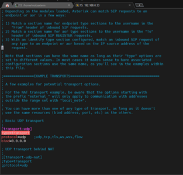

#### Crear usuarios (extensiones 2XXX)

> ⚠️ **Seguridad**: Las contraseñas de ejemplo (`Hola123`) son solo para entornos de laboratorio. En producción, usa contraseñas fuertes y únicas para cada usuario.

Ejemplo para el usuario 2001:

```ini
[2001-softphone]
type=endpoint
context=office-phone
disallow=all
allow=ulaw
auth=2001-auth
aors=2001

[2001-auth]
type=auth
auth_type=userpass
username=2001-softphone
password=Hola123

[2001]
type=aor
max_contacts=1
```

Configura el idioma globalmente:

```ini
[global]
type=global
language=es
```

Recarga la configuración:

```bash
asterisk -rx "pjsip reload"
```

#### Verificar usuarios

```bash
asterisk -rx "pjsip show endpoints"
asterisk -rx "pjsip show aors"
```

<a id="img-14"></a>

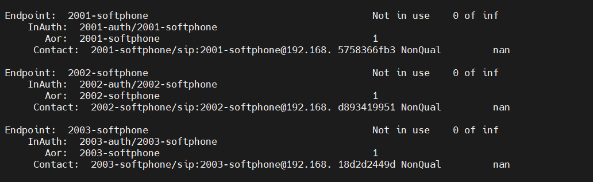

<a id="img-15"></a>

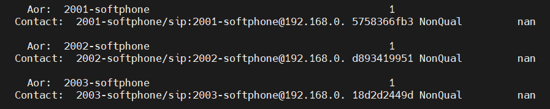

#### Editar `/etc/asterisk/extensions.conf`

Configurar llamadas entre usuarios:

```ini
[office-phone]
exten => 2001,1,Answer()
same => n,Dial(PJSIP/2001,20,m)
same => n,Hangup()

exten => 2002,1,Answer()
same => n,Dial(PJSIP/2002,20,m)
same => n,Hangup()
```

Recarga el dialplan:

```bash
asterisk -rx "dialplan reload"
```

#### 3. Zoiper

Zoiper es una aplicación VoIP gratuita compatible con Asterisk y se usa en la práctica para verificar el registro y las llamadas entre extensiones.

1. **Abrir Zoiper** y seleccionar "Continue with Free"
2. **Introducir credenciales**:
  - Usuario: `2001-softphone`
  - Contraseña: `Hola123`
3. **Configurar servidor**:
  - IP: Dirección IP del servidor Asterisk (`ip a`)
  - Puerto: `5060`
4. **Verificar conexión**: Debe aparecer "Registered" o "Online"

Pruebas recomendadas:
- Llamada interna: `2002`
- Buzón de voz: `2000`
- Menú IVR: `1010`

<a id="img-16"></a>

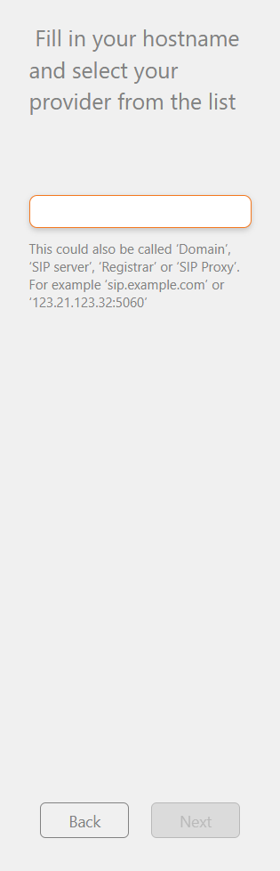

<a id="img-17"></a>

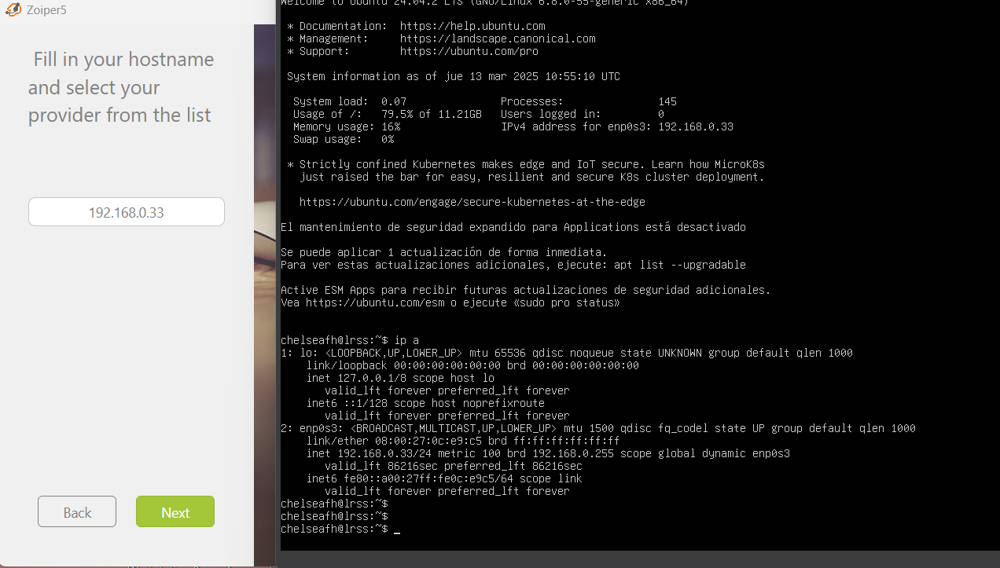

<a id="img-18"></a>

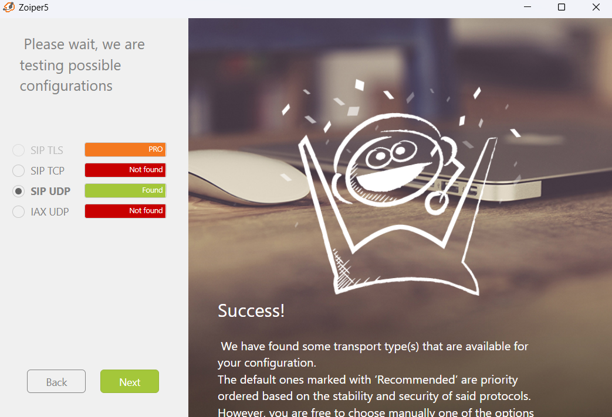

<a id="img-19"></a>

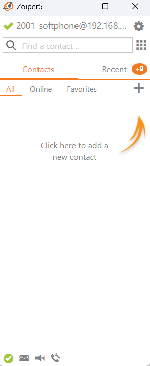

<a id="img-20"></a>

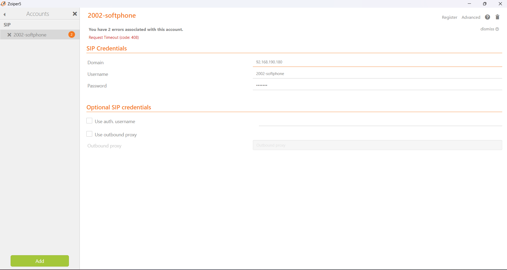

### 4. Configuración del Idioma

#### Crear directorio para español

```bash
sudo mkdir -p /var/lib/asterisk/sounds/es
```

#### Descargar paquetes de audio en español

Desde [https://www.sinologic.net/proyectos/vocesbak/](https://www.sinologic.net/proyectos/vocesbak/)

```bash
cd /var/lib/asterisk/sounds/es
sudo wget https://www.sinologic.net/proyectos/vocesbak/asterisk-sounds-core-es-gsm-1.4.27.tar.gz
sudo wget https://www.sinologic.net/proyectos/vocesbak/asterisk-sounds-extra-es-gsm-1.4.27.tar.gz
```

#### Descomprimir archivos

```bash
sudo tar -xvzf asterisk-sounds-core-es-gsm-1.4.27.tar.gz
sudo tar -xvzf asterisk-sounds-extra-es-gsm-1.4.27.tar.gz
```

#### Reorganizar archivos

Los archivos se descomprimen en subcarpetas `es/`. Muévelos al directorio principal:

```bash
sudo mv dictate/es/* dictate/
sudo mv digits/es/* digits/
sudo mv followme/es/* followme/
sudo mv letters/es/* letters/
sudo mv phonetic/es/* phonetic/
sudo mv silence/es/* silence/
```

<a id="img-21"></a>

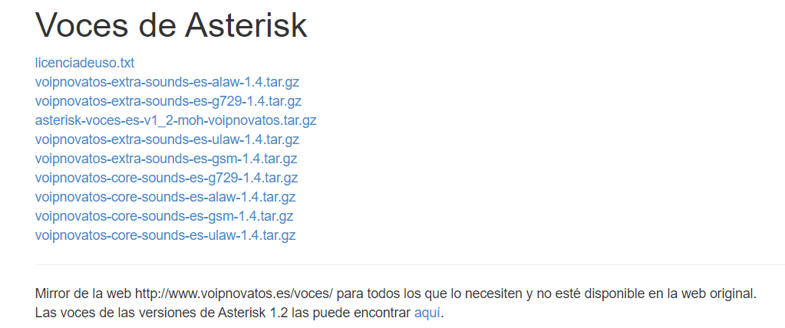

<a id="img-22"></a>

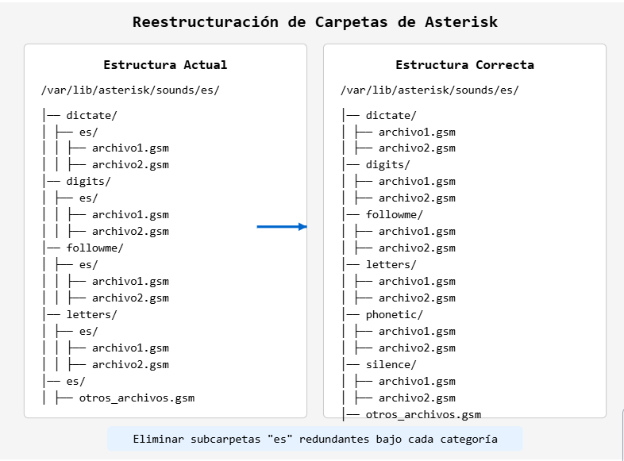

#### Asignar permisos

```bash
sudo chmod -R 755 /var/lib/asterisk/sounds/es
sudo chown -R asterisk:asterisk /var/lib/asterisk/sounds/es
```

---

### Funcionalidades

#### Buzón de Voz

#### Editar `/etc/asterisk/voicemail.conf`

```ini
[default]
2001 => 1234,Usuario 2001
2002 => 1234,Usuario 2002
2003 => 1234,Usuario 2003
```

#### Editar `/etc/asterisk/extensions.conf`

Añadir VoiceMail a las extensiones:

```ini
[office-phone]
exten => 2001,1,Answer()
same => n,Dial(PJSIP/2001,20,m)
same => n,VoiceMail(2001@default,u)
same => n,Hangup()
```

Extensión para acceder al buzón:

```ini
exten => 2000,1,Answer()
same => n,VoiceMailMain(@default)
same => n,Hangup()
```

#### Música en Espera

#### Crear directorio

```bash
sudo mkdir -p /var/lib/asterisk/sounds/custom
```

#### Copiar archivos de audio (formato WAV)

```bash
sudo cp mi_audio.wav /var/lib/asterisk/sounds/custom/
sudo sox mi_audio.wav -r 8000 -c 1 /var/lib/asterisk/sounds/custom/espera.wav
```

#### Editar `/etc/asterisk/musiconhold.conf`

```ini
[default]
mode=files
directory=/var/lib/asterisk/sounds/custom
random=yes
```

#### Añadir al dialplan

```ini
exten => 2001,n,MusicOnHold(default)
```

#### Transferencias

#### Editar `/etc/asterisk/features.conf`

```ini
[featuremap]
blindxfer => *1        ; Transferencia ciega
atxfer => *2           ; Transferencia asistida
automon => *3          ; Grabación automática
```

#### Habilitar en el dialplan

```ini
exten => 2001,n,Dial(PJSIP/2001,20,tTwW)
```

Opciones:
- `t`: Permite transferencias para quien llama
- `T`: Permite transferencias para quien recibe
- `w`: Permite grabación para quien llama
- `W`: Permite grabación para quien recibe

<a id="img-23"></a>

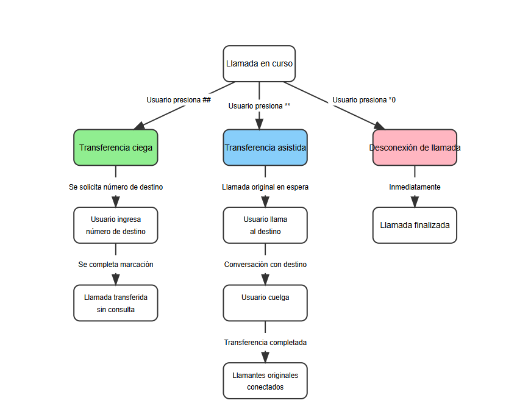

#### Conferencias

#### Editar `/etc/asterisk/confbridge.conf`

```ini
[user]
type=user
admin=no
pin=1234
marked=no
wait_marked=no
end_marked=no

[admin]
type=user
admin=yes
pin=5678
marked=yes

[bridge]
type=bridge
language=es
max_members=10
```

#### Añadir al dialplan

```ini
exten => 3000,1,Answer()
same => n,ConfBridge(1,bridge,user)
same => n,Hangup()

exten => 3001,1,Answer()
same => n,ConfBridge(1,bridge,admin)
same => n,Hangup()
```

<a id="img-24"></a>

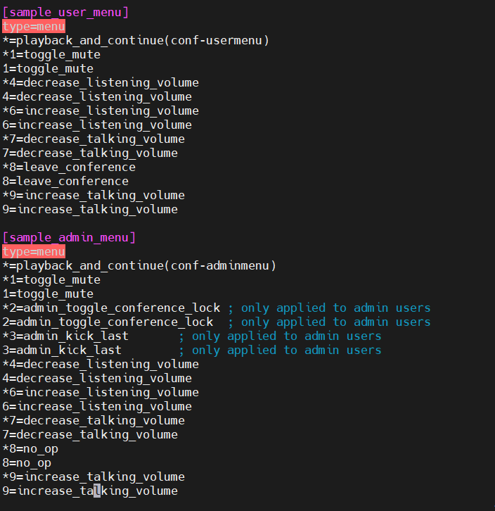

### Grabación de Llamadas

Asterisk permite grabar llamadas automáticamente o bajo demanda.

#### Configuración automática en el dialplan

Añade en `/etc/asterisk/extensions.conf` la aplicación `MixMonitor`:

```ini
[office-phone]
exten => 2001,1,Answer()
same => n,MixMonitor(/var/spool/asterisk/monitor/${UNIQUEID}.wav,b)
same => n,Dial(PJSIP/2001,20,tTwW)
same => n,StopMixMonitor()
same => n,VoiceMail(2001@default,u)
same => n,Hangup()
```

El parámetro `b` indica que la mezcla se realiza al finalizar la llamada (más eficiente). Los archivos se guardan en `/var/spool/asterisk/monitor/`.

#### Grabación bajo demanda

Con la opción `w`/`W` en `Dial()` y los códigos de `features.conf`, los usuarios pueden iniciar/detener la grabación marcando `*3` durante la llamada (según lo configurado en `automon`).

#### Asignar permisos al directorio

```bash
sudo mkdir -p /var/spool/asterisk/monitor
sudo chown -R asterisk:asterisk /var/spool/asterisk/monitor
sudo chmod 750 /var/spool/asterisk/monitor
```

> **Nota**: Revisa la legalidad de la grabación de llamadas en tu país antes de activarla en producción.

#### Texto a Voz - TTS

##### Festival

#### Instalar Festival

```bash
sudo apt install -y festival festvox-ellpc11k
```

#### Configurar Festival

Edita `/usr/share/festival/festival.scm` y añade antes de `(provide 'festival)`:

```scheme
(define (tts_textasterisk string mode)
  (let ((wholeutt (utt.synth (eval (list 'Utterance 'Text string)))))
    (utt.wave.resample wholeutt 8000)
    (utt.wave.rescale wholeutt 5)
    (utt.send.wave.client wholeutt)))
```

#### Crear servicio systemd

Crea `/etc/systemd/system/festival.service`:

```ini
[Unit]
Description=Festival Speech Synthesis Server
After=network.target

[Service]
Type=simple
User=festival
ExecStart=/usr/bin/festival --server
Restart=always

[Install]
WantedBy=multi-user.target
```

#### Instalar voces en español

```bash
cd /tmp
wget https://github.com/franjvasquezg/festival-spanish-voices/releases/download/1.0/es_voices.tar.gz
sudo tar -xvzf es_voices.tar.gz -C /usr/share/festival/voices/spanish/
```

#### Configurar `/etc/festival.scm`

```scheme
(set! voice_default 'voice_JuntaDeAndalucia_es_pa_diphone)
```

#### Configurar `/etc/asterisk/festival.conf`

```ini
[general]
host=localhost
port=1314
```

#### Iniciar Festival

```bash
sudo systemctl daemon-reload
sudo systemctl enable festival
sudo systemctl start festival
```

<a id="img-25"></a>

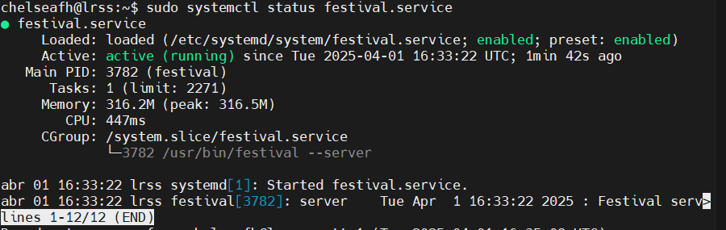

<a id="img-26"></a>

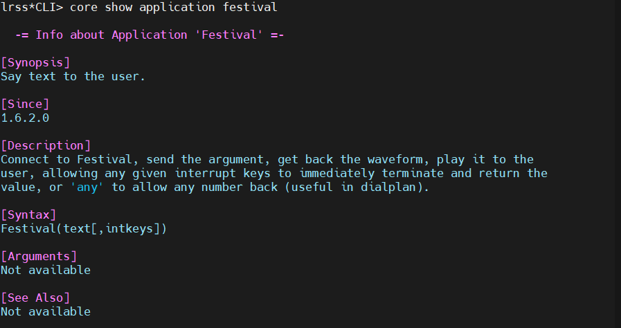

#### Usar en el dialplan

```ini
exten => 9000,1,Answer()
same => n,Festival("Bienvenido a la central Marchel")
same => n,Hangup()
```

#### Menú IVR

El menú IVR (Interactive Voice Response) permite a los usuarios interactuar con el sistema mediante el teclado telefónico.

#### Crear usuario operadora en `pjsip.conf`

```ini
[1010]
type=endpoint
context=operadora-menu
disallow=all
allow=ulaw
auth=1010-auth
aors=1010

[1010-auth]
type=auth
auth_type=userpass
username=1010
password=Pass123

[1010]
type=aor
max_contacts=1
```

#### Configurar menú en `extensions.conf`

```ini
[operadora-menu]
exten => s,1,Answer()
same => n,Set(TIMEOUT(digit)=5)
same => n,Set(TIMEOUT(response)=10)
same => n(menu),Background(custom/bienvenida)
same => n,WaitExten()

; Opción 1: Soporte técnico
exten => 1,1,Goto(soporte-tecnico,s,1)

; Opción 2: Información de tarifas
exten => 2,1,Answer()
same => n,Festival("Las tarifas son de 0.05 euros por minuto")
same => n,Goto(operadora-menu,s,menu)

; Opción 3: Buzón de voz
exten => 3,1,VoiceMailMain(@default)
same => n,Hangup()

; Opción 0: Volver a escuchar el menú
exten => 0,1,Goto(operadora-menu,s,menu)

; Timeout o entrada inválida
exten => i,1,Playback(invalid)
same => n,Goto(operadora-menu,s,menu)

exten => t,1,Playback(vm-goodbye)
same => n,Hangup()
```

<a id="img-27"></a>

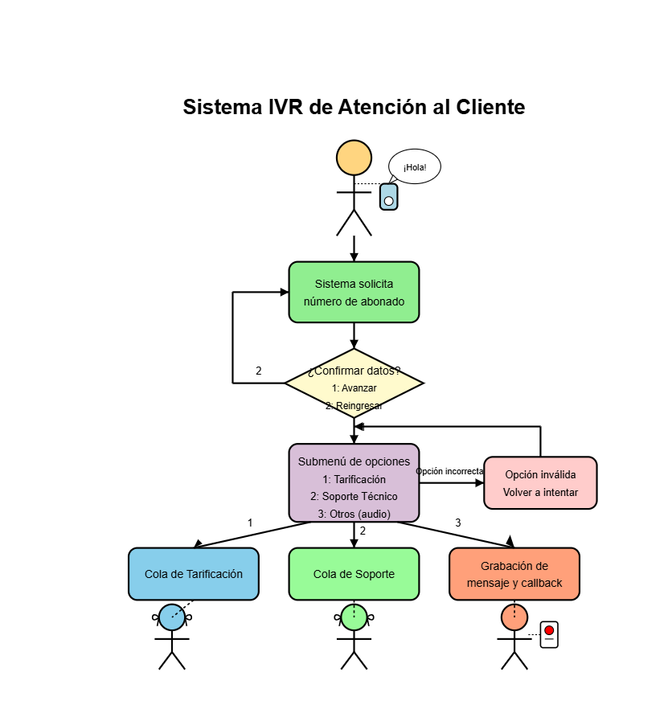

#### Llamadas en Cola

#### Editar `/etc/asterisk/queues.conf`

```ini
[soporte-tecnico]
strategy=rrmemory
timeout=30
retry=5
maxlen=10
announce-frequency=60
announce-holdtime=yes
music=default
member => PJSIP/2001
member => PJSIP/2002
member => PJSIP/2003
```

Estrategias disponibles:
- `ringall`: Llama a todos los agentes
- `leastrecent`: Llama al que menos recientemente atendió
- `fewestcalls`: Llama al que menos llamadas atendió
- `random`: Llamada aleatoria
- `rrmemory`: Round-robin con memoria

#### Configurar en el dialplan

```ini
[soporte-tecnico]
exten => s,1,Answer()
same => n,Queue(soporte-tecnico,tTwW)
same => n,Hangup()
```

<a id="img-28"></a>

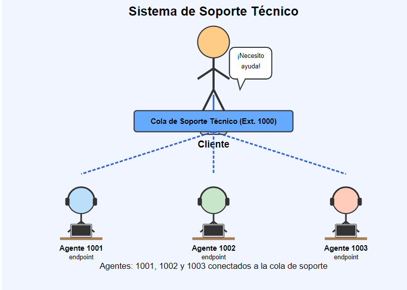

#### Conexión PBXs

Esta funcionalidad permite conectar dos centrales telefónicas Asterisk diferentes mediante troncales PJSIP, permitiendo que usuarios de diferentes servidores puedan comunicarse entre sí.

#### Arquitectura de la conexión

```
┌─────────────────────┐  Troncal PJSIP   ┌─────────────────────┐
│   Servidor A        │◄────────────────►│   Servidor B        │
│   IP: 192.168.1.10  │   (UDP:5060)     │   IP: 192.168.1.78  │
│   Usuarios: 2XXX    │                  │   Usuarios: 6XXX    │
└─────────────────────┘                  └─────────────────────┘
```

#### Configuración en Servidor A

##### 1. Editar `/etc/asterisk/pjsip.conf` en Servidor A

```ini
; Configuración del endpoint para Servidor B
[servidorB]
type=endpoint
context=office-phone
transport=transport-udp
disallow=all
allow=ulaw,alaw,gsm
aors=servidorB-aor
outbound_auth=servidorB-auth
direct_media=no

; Configuración de autenticación
[servidorB-auth]
type=auth
auth_type=userpass
username=servidorB
password=Hola123
realm=servidorB

; Configuración del AOR (Address of Record)
[servidorB-aor]
type=aor
contact=sip:192.168.1.78

; Configuración de registro
[servidorB-registration]
type=registration
outbound_auth=servidorB-auth
server_uri=sip:192.168.1.78
client_uri=sip:servidorB@192.168.1.78
retry_interval=60

; Identificación del servidor remoto
[servidorB-identify]
type=identify
endpoint=servidorB
match=192.168.1.78
```

##### 2. Editar `/etc/asterisk/extensions.conf` en Servidor A

```ini
[office-phone]
; Llamadas locales (usuarios 2XXX)
exten => _2XXX,1,Answer()
same => n,Dial(PJSIP/${EXTEN},20,m)
same => n,Hangup()

; Llamadas al Servidor B (usuarios 6XXX)
exten => _6XXX,1,Answer()
same => n,Dial(PJSIP/${EXTEN}@servidorB,25)
same => n,Hangup()
```

#### Configuración en Servidor B

##### 1. Editar `/etc/asterisk/pjsip.conf` en Servidor B

```ini
; Configuración del endpoint para Servidor A
[servidorA]
type=endpoint
context=office-phone
transport=transport-udp
disallow=all
allow=ulaw,alaw,gsm
aors=servidorA-aor
outbound_auth=servidorA-auth
direct_media=no

; Configuración de autenticación
[servidorA-auth]
type=auth
auth_type=userpass
username=servidorA
password=Hola123
realm=servidorA

; Configuración del AOR
[servidorA-aor]
type=aor
contact=sip:192.168.1.10

; Configuración de registro
[servidorA-registration]
type=registration
outbound_auth=servidorA-auth
server_uri=sip:192.168.1.10
client_uri=sip:servidorA@192.168.1.10
retry_interval=60

; Identificación del servidor remoto
[servidorA-identify]
type=identify
endpoint=servidorA
match=192.168.1.10
```

##### 2. Editar `/etc/asterisk/extensions.conf` en Servidor B

```ini
[office-phone]
; Llamadas locales (usuarios 6XXX)
exten => _6XXX,1,Answer()
same => n,Dial(PJSIP/${EXTEN},20,m)
same => n,Hangup()

; Llamadas al Servidor A (usuarios 2XXX)
exten => _2XXX,1,Answer()
same => n,Dial(PJSIP/${EXTEN}@servidorA,25)
same => n,Hangup()
```

#### Parámetros importantes

- **direct_media=no**: Desactiva la conexión directa entre endpoints, útil cuando hay NAT
- **outbound_auth**: Define las credenciales para autenticación saliente
- **realm**: Identifica el dominio de autenticación del servidor remoto
- **retry_interval**: Tiempo en segundos entre intentos de registro
- **match**: Dirección IP del servidor remoto para identificación

#### Configuración de NAT

Si los servidores están detrás de NAT (por ejemplo, en redes con IPs privadas), añade en `/etc/asterisk/pjsip.conf` la sección de transporte con parámetros NAT:

```ini
[transport-udp]
type=transport
protocol=udp
bind=0.0.0.0
local_net=192.168.1.0/24        ; Red local
external_media_address=0.0.0.0  ; IP pública (si aplica)
external_signaling_address=0.0.0.0  ; IP pública (si aplica)
```

Y en cada endpoint de troncal, asegúrate de tener:

```ini
[servidorB]
type=endpoint
; ... resto de parámetros ...
direct_media=no
ice_support=no
rtp_symmetric=yes
force_rport=yes
rewrite_contact=yes
```

#### Verificación de la conexión

En ambos servidores, verifica:

```bash
# Ver endpoints configurados
asterisk -rx "pjsip show endpoints"

# Ver registros activos
asterisk -rx "pjsip show registrations"

# Ver identificaciones
asterisk -rx "pjsip show identities"

# Probar conectividad
asterisk -rx "pjsip qualify servidorA"  # En Servidor B
asterisk -rx "pjsip qualify servidorB"  # En Servidor A
```

#### Solución de problemas comunes

**El registro falla**:
- Verifica que las IPs sean correctas y accesibles
- Comprueba que el puerto 5060 esté abierto en ambos firewalls
- Verifica las credenciales (username/password)

**No se pueden realizar llamadas**:
- Verifica el dialplan en ambos servidores
- Comprueba que los contextos coincidan
- Revisa los logs: `tail -f /var/log/asterisk/messages`

**Problemas de audio**:
- Verifica los códecs permitidos (allow/disallow)
- Comprueba la configuración de NAT si aplica
- Revisa que `direct_media=no` esté configurado

#### Ejemplo de uso

Una vez configurado:

1. Usuario 2001 en Servidor A marca `6001`
2. La llamada se enruta a través del troncal hacia Servidor B
3. El usuario 6001 en Servidor B recibe la llamada
4. Viceversa para llamadas de 6XXX hacia 2XXX

#### Instalación de MariaDB

#### Instalar MariaDB

```bash
sudo apt install -y mariadb-server mariadb-client
sudo systemctl enable mariadb
sudo systemctl start mariadb
sudo mysql_secure_installation
```

<a id="img-29"></a>

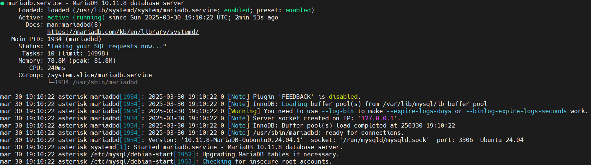

#### Crear base de datos y usuario

```bash
sudo mysql -u root -p
```

```sql
CREATE DATABASE asterisk_cdr;
CREATE USER 'asterisk'@'localhost' IDENTIFIED BY 'password123';
GRANT ALL PRIVILEGES ON asterisk_cdr.* TO 'asterisk'@'localhost';
FLUSH PRIVILEGES;
EXIT;
```

<a id="img-30"></a>

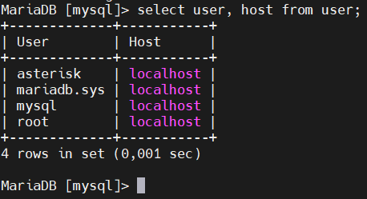

<a id="img-31"></a>

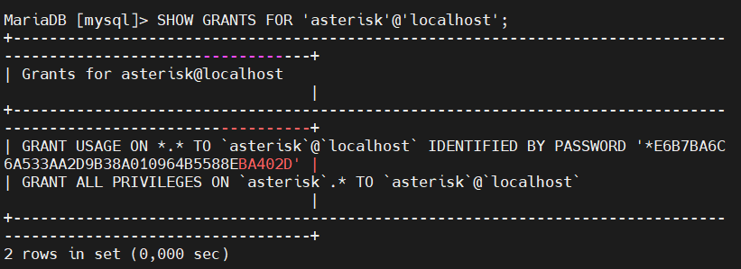

#### Crear tabla CDR

> ⚠️ Esta tabla incluye las columnas `coste` y `tarificado` necesarias para el script de tarificación.

```sql
USE asterisk_cdr;

CREATE TABLE cdr (
    calldate DATETIME NOT NULL DEFAULT '0000-00-00 00:00:00',
    clid VARCHAR(80) NOT NULL DEFAULT '',
    src VARCHAR(80) NOT NULL DEFAULT '',
    dst VARCHAR(80) NOT NULL DEFAULT '',
    dcontext VARCHAR(80) NOT NULL DEFAULT '',
    channel VARCHAR(80) NOT NULL DEFAULT '',
    dstchannel VARCHAR(80) NOT NULL DEFAULT '',
    lastapp VARCHAR(80) NOT NULL DEFAULT '',
    lastdata VARCHAR(80) NOT NULL DEFAULT '',
    duration INT(11) NOT NULL DEFAULT 0,
    billsec INT(11) NOT NULL DEFAULT 0,
    disposition VARCHAR(45) NOT NULL DEFAULT '',
    amaflags INT(11) NOT NULL DEFAULT 0,
    accountcode VARCHAR(20) NOT NULL DEFAULT '',
    uniqueid VARCHAR(150) NOT NULL DEFAULT '',
    userfield VARCHAR(255) NOT NULL DEFAULT '',
    coste DECIMAL(10,4) NOT NULL DEFAULT 0.0000,
    tarificado TINYINT(1) NOT NULL DEFAULT 0
);
```

<a id="img-32"></a>

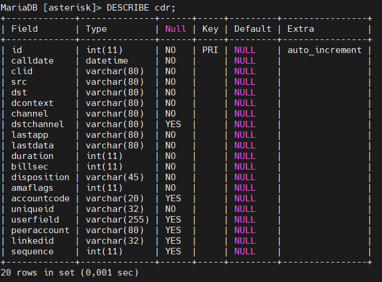

#### Instalar ODBC

```bash
sudo apt install -y unixodbc unixodbc-dev libmyodbc
```

#### Configurar ODBC

Edita `/etc/odbcinst.ini`:

```ini
[MySQL]
Description = MySQL driver
Driver = /usr/lib/x86_64-linux-gnu/odbc/libmyodbc8w.so
Setup = /usr/lib/x86_64-linux-gnu/odbc/libodbcmyS.so
FileUsage = 1
```

Edita `/etc/odbc.ini`:

```ini
[asterisk-connector]
Description = MySQL connection to asterisk database
Driver = MySQL
Database = asterisk_cdr
Server = localhost
Port = 3306
Socket = /var/run/mysqld/mysqld.sock
```

#### Configurar Asterisk

Edita `/etc/asterisk/res_odbc.conf`:

```ini
[asterisk]
enabled => yes
dsn => asterisk-connector
username => asterisk
password => password123
pre-connect => yes
```

Edita `/etc/asterisk/cdr_adaptive_odbc.conf`:

```ini
[first]
connection=asterisk
table=cdr
```

#### Verificar conexión

```bash
asterisk -rx "odbc show"
```

<a id="img-33"></a>

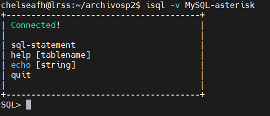

<a id="img-34"></a>

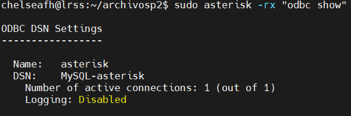

#### Tarificación

El repositorio incluye el script de tarificación en `scripts/tarificar.py`, que procesa registros CDR y calcula costes automáticamente.

#### Correspondencia de nombres de archivos (PDF ↔ repositorio)

| En la memoria PDF | En este repositorio | Estado |
|---|---|---|
| `/usr/local/bin/tarificar.py` | `scripts/tarificar.py` | Script principal actual |
| `billing_job.py` (referencia heredada) | `scripts/billing_job.py` | Compatibilidad / versión anterior |
| `app.py` web | `app/web/app.py` | Implementación actual |
| `/var/www/marchel/templates/*.html` | `app/web/templates/*.html` | Plantillas actuales |

> Recomendación: usar `scripts/tarificar.py` como referencia principal para despliegue y dejar `scripts/billing_job.py` como script legacy.

Para instalarlo en el servidor:

```bash
sudo cp scripts/tarificar.py /usr/local/bin/tarificar.py
sudo chmod 755 /usr/local/bin/tarificar.py
```

Automatización con CRON:

```bash
sudo crontab -e
```

Añadir:

```cron
*/5 * * * * /usr/bin/python3 /usr/local/bin/tarificar.py >> /var/log/tarificar.log 2>&1
```

<a id="img-35"></a>

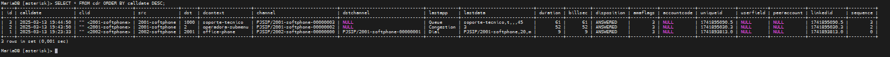

<a id="img-36"></a>

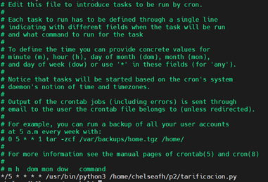

##### www.marchel.com

La interfaz web está desarrollada con Flask y permite a los usuarios consultar estadísticas, historial de llamadas y tarifas.

> Aclaración importante sobre el dominio:
> - `www.marchel.com` se usa como **nombre funcional del proyecto** y ejemplo de despliegue.
> - Este repositorio **no acredita propiedad ni control** sobre ese dominio público.
> - Para pruebas o despliegue real, usa tu propio dominio/subdominio o IP (por ejemplo: `http://IP_SERVIDOR:5050` o `https://pbx.tu-dominio.com`).

#### Instalar dependencias

```bash
sudo apt install -y python3 python3-pip python3-venv
pip3 install flask mysql-connector-python pandas matplotlib
```

#### Estructura del proyecto

```
app/web/
├── app.py
├── __init__.py
├── templates/
│   ├── dashboard.html
│   ├── estadisticas.html
│   ├── historial.html
│   ├── index.html
│   ├── tarifas.html
│   └── tendencias.html
└── static/
  ├── css/
  │   └── styles.css
  └── img/
    └── logo-marchel.png
```

#### Ejecutar la aplicación web

```bash
python3 -m venv .venv
source .venv/bin/activate
pip install -r requirements.txt
cp .env.example .env
python app/web/app.py
```

En el repositorio, la aplicación ya está implementada en `app/web/app.py` y usa variables de entorno definidas en `.env`.

Para ejecutarla como servicio en producción, crea `/etc/systemd/system/marchel-web.service`:

```ini
[Unit]
Description=Marchel Web Interface
After=network.target mariadb.service

[Service]
Type=simple
User=www-data
WorkingDirectory=/ruta/al/repositorio/Marchel-Asterisk
ExecStart=/usr/bin/python3 app/web/app.py
Restart=always

[Install]
WantedBy=multi-user.target
```

```bash
sudo systemctl daemon-reload
sudo systemctl enable marchel-web
sudo systemctl start marchel-web
```

Accede en el navegador: `http://<IP_SERVIDOR>:5050`

<a id="img-37"></a>

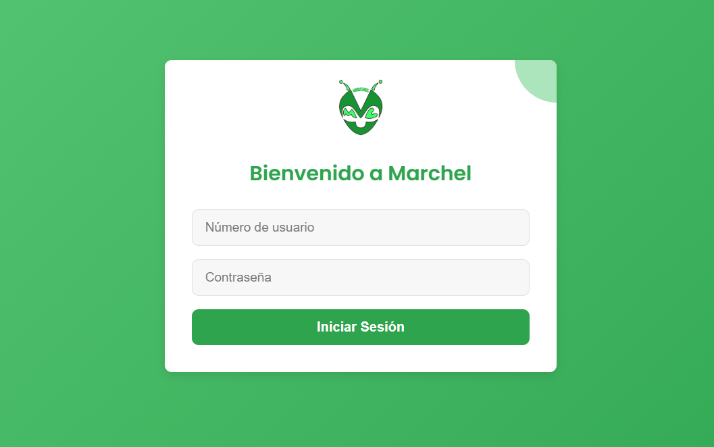

<a id="img-38"></a>

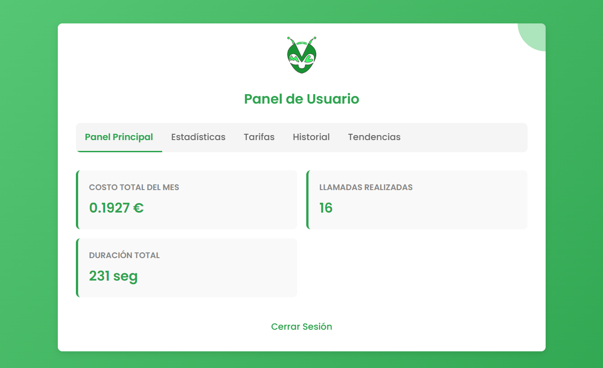

<a id="img-39"></a>

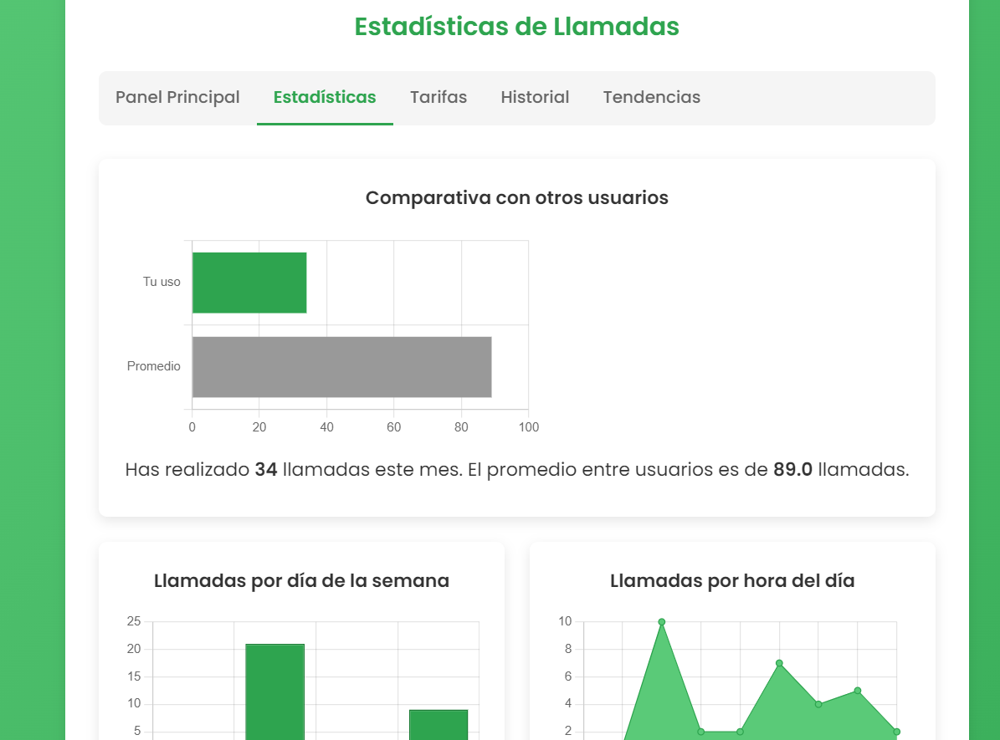

<a id="img-40"></a>

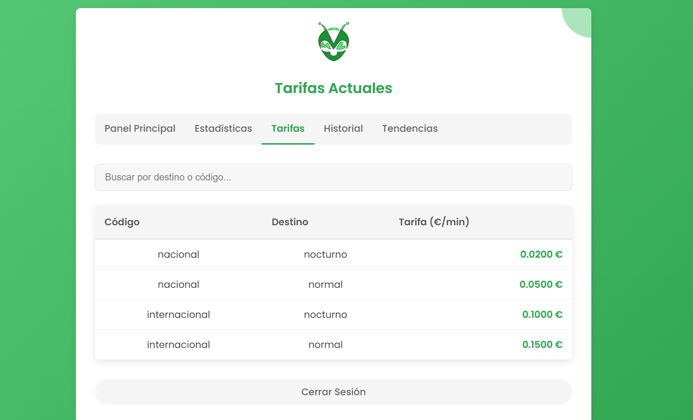

<a id="img-41"></a>

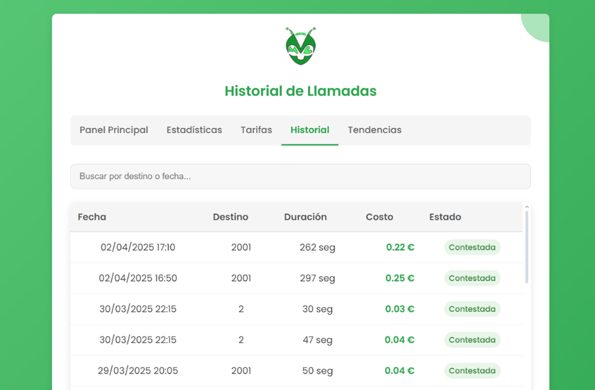

<a id="img-42"></a>

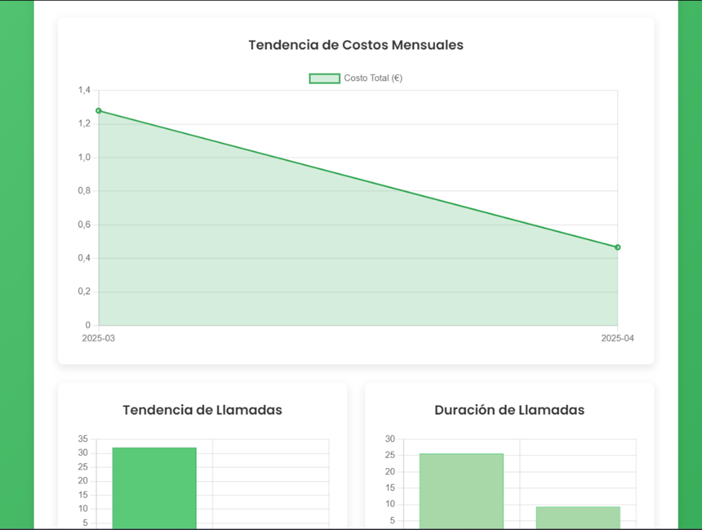

---

## 🗺️ Mapa de imágenes (auditoría)

| Imagen | Archivo | Sección correspondiente |
|---|---|---|
| [1](#img-01) | [imagen-01-instalacion-asterisk-completada.png](assets/readme/pdf/imagen-01-instalacion-asterisk-completada.png) | [1. Instalación de Asterisk](#1-instalación-de-asterisk) |
| [2](#img-02) | [imagen-02-configuracion-de-asterisk.png](assets/readme/pdf/imagen-02-configuracion-de-asterisk.png) | [1. Instalación de Asterisk](#1-instalación-de-asterisk) |
| [3](#img-03) | [imagen-03-menu-de-configuraciones-de-asterisk-1.png](assets/readme/pdf/imagen-03-menu-de-configuraciones-de-asterisk-1.png) | [1. Instalación de Asterisk](#1-instalación-de-asterisk) |
| [4](#img-04) | [imagen-04-menu-de-configuraciones-de-asterisk-2.png](assets/readme/pdf/imagen-04-menu-de-configuraciones-de-asterisk-2.png) | [1. Instalación de Asterisk](#1-instalación-de-asterisk) |
| [5](#img-05) | [imagen-05-menu-de-configuraciones-de-asterisk-3.png](assets/readme/pdf/imagen-05-menu-de-configuraciones-de-asterisk-3.png) | [1. Instalación de Asterisk](#1-instalación-de-asterisk) |
| [6](#img-06) | [imagen-06-menu-de-configuraciones-de-asterisk-4.png](assets/readme/pdf/imagen-06-menu-de-configuraciones-de-asterisk-4.png) | [1. Instalación de Asterisk](#1-instalación-de-asterisk) |
| [7](#img-07) | [imagen-07-menu-de-configuraciones-de-asterisk-5.png](assets/readme/pdf/imagen-07-menu-de-configuraciones-de-asterisk-5.png) | [1. Instalación de Asterisk](#1-instalación-de-asterisk) |
| [8](#img-08) | [imagen-08-menu-de-configuraciones-de-asterisk-6.png](assets/readme/pdf/imagen-08-menu-de-configuraciones-de-asterisk-6.png) | [1. Instalación de Asterisk](#1-instalación-de-asterisk) |
| [9](#img-09) | [imagen-09-menu-de-configuraciones-de-asterisk-7.png](assets/readme/pdf/imagen-09-menu-de-configuraciones-de-asterisk-7.png) | [1. Instalación de Asterisk](#1-instalación-de-asterisk) |
| [10](#img-10) | [imagen-10-instalacion-de-configuraciones-de-asterisk-mediante-el-makefile.png](assets/readme/pdf/imagen-10-instalacion-de-configuraciones-de-asterisk-mediante-el-makefile.png) | [1. Instalación de Asterisk](#1-instalación-de-asterisk) |
| [11](#img-11) | [imagen-11-instalacion-de-la-configuracion-de-asterisk-completada.png](assets/readme/pdf/imagen-11-instalacion-de-la-configuracion-de-asterisk-completada.png) | [1. Instalación de Asterisk](#1-instalación-de-asterisk) |
| [12](#img-12) | [imagen-12-interfaz-de-asterisk-en-modo-verboso.png](assets/readme/pdf/imagen-12-interfaz-de-asterisk-en-modo-verboso.png) | [1. Instalación de Asterisk](#1-instalación-de-asterisk) |
| [13](#img-13) | [imagen-13-protocolo-de-transporte-udp-dentro-de-pjsip-conf.png](assets/readme/pdf/imagen-13-protocolo-de-transporte-udp-dentro-de-pjsip-conf.png) | [2. Creación de Usuarios](#2-creación-de-usuarios) |
| [14](#img-14) | [imagen-14-comprobacion-de-los-endpoints-en-asterisk.png](assets/readme/pdf/imagen-14-comprobacion-de-los-endpoints-en-asterisk.png) | [2. Creación de Usuarios](#2-creación-de-usuarios) |
| [15](#img-15) | [imagen-15-comprobacion-de-los-aors-en-asterisk.png](assets/readme/pdf/imagen-15-comprobacion-de-los-aors-en-asterisk.png) | [2. Creación de Usuarios](#2-creación-de-usuarios) |
| [16](#img-16) | [imagen-16-formulario-de-inicio-de-sesion-de-zoiper.png](assets/readme/pdf/imagen-16-formulario-de-inicio-de-sesion-de-zoiper.png) | [3. Zoiper](#3-zoiper) |
| [17](#img-17) | [imagen-17-comprobacion-y-configuracion-de-la-ip-en-zoiper.png](assets/readme/pdf/imagen-17-comprobacion-y-configuracion-de-la-ip-en-zoiper.png) | [3. Zoiper](#3-zoiper) |
| [18](#img-18) | [imagen-18-conexion-establecida-de-un-usuario-final-en-zoiper.png](assets/readme/pdf/imagen-18-conexion-establecida-de-un-usuario-final-en-zoiper.png) | [3. Zoiper](#3-zoiper) |
| [19](#img-19) | [imagen-19-interfaz-de-llamadas-de-zoiper.png](assets/readme/pdf/imagen-19-interfaz-de-llamadas-de-zoiper.png) | [3. Zoiper](#3-zoiper) |
| [20](#img-20) | [imagen-20-menu-de-configuracion-de-usuarios-de-zoiper.png](assets/readme/pdf/imagen-20-menu-de-configuracion-de-usuarios-de-zoiper.png) | [3. Zoiper](#3-zoiper) |
| [21](#img-21) | [imagen-21-voces-esp-asterisk.png](assets/readme/pdf/imagen-21-voces-esp-asterisk.png) | [4. Configuración del Idioma](#4-configuración-del-idioma) |
| [22](#img-22) | [imagen-22-ejemplo-visual-de-carpetas-de-audios-del-idioma-espanol.png](assets/readme/pdf/imagen-22-ejemplo-visual-de-carpetas-de-audios-del-idioma-espanol.png) | [4. Configuración del Idioma](#4-configuración-del-idioma) |
| [23](#img-23) | [imagen-23-diagrama-de-flujo-del-funcionamiento-de-las-redirecciones.png](assets/readme/pdf/imagen-23-diagrama-de-flujo-del-funcionamiento-de-las-redirecciones.png) | [Transferencias](#transferencias) |
| [24](#img-24) | [imagen-24-menus-de-control-de-usuario-del-archivo-confbridge-conf.png](assets/readme/pdf/imagen-24-menus-de-control-de-usuario-del-archivo-confbridge-conf.png) | [Conferencias](#conferencias) |
| [25](#img-25) | [imagen-25-comprobacion-de-que-festival-esta-activo.png](assets/readme/pdf/imagen-25-comprobacion-de-que-festival-esta-activo.png) | [Festival](#festival) |
| [26](#img-26) | [imagen-26-comprobacion-de-que-festival-se-ha-configurado-correctamente-en-asterisk.png](assets/readme/pdf/imagen-26-comprobacion-de-que-festival-se-ha-configurado-correctamente-en-asterisk.png) | [Festival](#festival) |
| [27](#img-27) | [imagen-27-diagrama-de-flujo-sobre-el-funcionamiento-del-menu-ivr.png](assets/readme/pdf/imagen-27-diagrama-de-flujo-sobre-el-funcionamiento-del-menu-ivr.png) | [Menú IVR](#menú-ivr) |
| [28](#img-28) | [imagen-28-diagrama-de-flujo-de-funcionamiento-de-la-cola-de-llamadas-del-soporte-tecnico.png](assets/readme/pdf/imagen-28-diagrama-de-flujo-de-funcionamiento-de-la-cola-de-llamadas-del-soporte-tecnico.png) | [Llamadas en Cola](#llamadas-en-cola) |
| [29](#img-29) | [imagen-29-comprobacion-de-que-mariadb-se-encuentra-activa.png](assets/readme/pdf/imagen-29-comprobacion-de-que-mariadb-se-encuentra-activa.png) | [Instalación de MariaDB](#instalación-de-mariadb) |
| [30](#img-30) | [imagen-30-comprobacion-de-creacion-del-usuario-asterisk-dentro-de-mariadb.png](assets/readme/pdf/imagen-30-comprobacion-de-creacion-del-usuario-asterisk-dentro-de-mariadb.png) | [Instalación de MariaDB](#instalación-de-mariadb) |
| [31](#img-31) | [imagen-31-comprobacion-de-permisos-del-usuario-asterisk.png](assets/readme/pdf/imagen-31-comprobacion-de-permisos-del-usuario-asterisk.png) | [Instalación de MariaDB](#instalación-de-mariadb) |
| [32](#img-32) | [imagen-32-comprobacion-de-la-creacion-de-la-tabla-cdr.png](assets/readme/pdf/imagen-32-comprobacion-de-la-creacion-de-la-tabla-cdr.png) | [Instalación de MariaDB](#instalación-de-mariadb) |
| [33](#img-33) | [imagen-33-comprobacion-de-que-mariadb-se-ha-conectado-correctamente-a-asterisk.png](assets/readme/pdf/imagen-33-comprobacion-de-que-mariadb-se-ha-conectado-correctamente-a-asterisk.png) | [Instalación de MariaDB](#instalación-de-mariadb) |
| [34](#img-34) | [imagen-34-comprobacion-de-que-el-conector-odbc-esta-bien-conectado-a-asterisk.png](assets/readme/pdf/imagen-34-comprobacion-de-que-el-conector-odbc-esta-bien-conectado-a-asterisk.png) | [Instalación de MariaDB](#instalación-de-mariadb) |
| [35](#img-35) | [imagen-35-ejemplo-de-como-deben-salir-los-datos-tras-las-llamadas.png](assets/readme/pdf/imagen-35-ejemplo-de-como-deben-salir-los-datos-tras-las-llamadas.png) | [Tarificación](#tarificación) |
| [36](#img-36) | [imagen-36-interfaz-cron.png](assets/readme/pdf/imagen-36-interfaz-cron.png) | [Tarificación](#tarificación) |
| [37](#img-37) | [imagen-37-web-inicio-de-sesion.png](assets/readme/pdf/imagen-37-web-inicio-de-sesion.png) | [www.marchel.com](#wwwmarchelcom) |
| [38](#img-38) | [imagen-38-web-panel-principal.png](assets/readme/pdf/imagen-38-web-panel-principal.png) | [www.marchel.com](#wwwmarchelcom) |
| [39](#img-39) | [imagen-39-web-estadisticas.png](assets/readme/pdf/imagen-39-web-estadisticas.png) | [www.marchel.com](#wwwmarchelcom) |
| [40](#img-40) | [imagen-40-web-tarifas.png](assets/readme/pdf/imagen-40-web-tarifas.png) | [www.marchel.com](#wwwmarchelcom) |
| [41](#img-41) | [imagen-41-web-historial.png](assets/readme/pdf/imagen-41-web-historial.png) | [www.marchel.com](#wwwmarchelcom) |
| [42](#img-42) | [imagen-42-web-tendencias.png](assets/readme/pdf/imagen-42-web-tendencias.png) | [www.marchel.com](#wwwmarchelcom) |

### Mapa por sección (revisión docente rápida)

| Sección | Imágenes |
|---|---|
| [1. Instalación de Asterisk](#1-instalación-de-asterisk) | [1](#img-01)–[12](#img-12) |
| [2. Creación de Usuarios](#2-creación-de-usuarios) | [13](#img-13)–[15](#img-15) |
| [3. Zoiper](#3-zoiper) | [16](#img-16)–[20](#img-20) |
| [4. Configuración del Idioma](#4-configuración-del-idioma) | [21](#img-21)–[22](#img-22) |
| [Transferencias](#transferencias) | [23](#img-23) |
| [Conferencias](#conferencias) | [24](#img-24) |
| [Festival](#festival) | [25](#img-25)–[26](#img-26) |
| [Menú IVR](#menú-ivr) | [27](#img-27) |
| [Llamadas en Cola](#llamadas-en-cola) | [28](#img-28) |
| [Instalación de MariaDB](#instalación-de-mariadb) | [29](#img-29)–[34](#img-34) |
| [Tarificación](#tarificación) | [35](#img-35)–[36](#img-36) |
| [www.marchel.com](#wwwmarchelcom) | [37](#img-37)–[42](#img-42) |

---

## 📎 Anexo: Zoiper (detalle)

Zoiper es una aplicación VoIP gratuita compatible con Asterisk.

### Descargar Zoiper

- **Android/iOS**: Busca "Zoiper" en la tienda de aplicaciones
- **Desktop**: [https://www.zoiper.com/en/voip-softphone/download/current](https://www.zoiper.com/en/voip-softphone/download/current)

### Configurar usuario

1. **Abrir Zoiper** y seleccionar "Continue with Free"
2. **Introducir credenciales**:
   - Usuario: `2001-softphone`
   - Contraseña: `Hola123`
3. **Configurar servidor**:
   - IP: Dirección IP de tu servidor Asterisk (obtenerla con `ip a`)
   - Puerto: `5060` (por defecto)
4. **Verificar conexión**: Debe aparecer "Registered" o "Online"

### Realizar llamadas

- Para llamar a otro usuario, marca su extensión (ej: `2002`)
- Para acceder al buzón de voz, marca `2000`
- Para unirte a la conferencia, marca `3000`
- Para acceder al menú IVR, marca `1010`
- Para llamar a otra PBX, marca extensiones como `6001`, `6002`, etc.

---

## 🏗️ Arquitectura del Sistema

```
┌─────────────────────────────────────────────────────────┐
│                    Usuarios Finales                     │
│              (Zoiper, Softphones, etc.)                 │
└─────────────────────────────┬───────────────────────────┘
                              │
                              │ SIP/PJSIP (UDP:5060)
                              │
┌─────────────────────────────▼──────────────────────────┐
│                  Servidor Asterisk A                   │
│  ┌─────────────────────────────────────────────────┐   │
│  │        Módulos Principales                      │   │
│  │          • PJSIP (Gestión de usuarios)          │   │
│  │          • Dialplan (Lógica de llamadas)        │   │
│  │          • Voicemail (Buzones de voz)           │   │
│  │          • ConfBridge (Conferencias)            │   │
│  │          • Queue (Colas de llamadas)            │   │
│  │          • Festival (Text-to-Speech)            │   │
│  └─────────────────────────────────────────────────┘   │
└─────────────────┬───────────────────────────┬──────────┘
                  │                           │
        ┌─────────┴────────┐                  │ Troncal PJSIP
        │                  │                  │
        ▼                  ▼                  ▼
┌────────────────┐  ┌─────────────┐  ┌──────────────────┐
│   MariaDB      │  │ Interfaz Web│  │  Servidor        │
│   (CDR, etc.)  │  │   (Flask)   │  │  Asterisk B      │
└────────────────┘  └─────────────┘  └──────────────────┘
```

---

## 💡 Contribuciones y Sugerencias

Este proyecto fue desarrollado como parte de un trabajo universitario. Si tienes sugerencias, comentarios o detectas algún error en la documentación, nos encantaría conocer tu opinión.

### 📧 Contacto:

<p align="center">
  <a href="mailto:marcos.santos.aragon@gmail.com" target="_blank">
    
  </a>
  <a href="mailto:chelseafh2003@gmail.com" target="_blank">
    
  </a>
</p>

Estaremos encantados de recibir tu feedback sobre:
- ✅ Mejoras en la documentación
- ✅ Correcciones de errores
- ✅ Sugerencias de nuevas funcionalidades
- ✅ Experiencias al implementar esta guía

---

## 👥 Autores

Este proyecto fue desarrollado como **Práctica 2** de la asignatura *Laboratorio de Redes, Señales y Sistemas* en la **Universidad Politécnica de Alcalá de Henares**.

**Desarrolladores**:

<table>
  <tr>
    <td align="center">
      <strong>Marcos Santos Aragón</strong><br>
      <a href="https://www.linkedin.com/in/marcos-santos-aragón/" target="_blank">
        
      </a>
      <a href="https://github.com/MarcosSAuah" target="_blank">
        
      </a>
    </td>
    <td align="center">
      <strong>Chelsea Fernández Hernández</strong><br>
      <a href="https://www.linkedin.com/in/chelsea-fernandez-hernandez-64a339189/" target="_blank">
        
      </a>
      <a href="https://github.com/Chelseafh" target="_blank">
        
      </a>
    </td>
  </tr>
</table>

**Universidad**: Universidad Politécnica de Alcalá de Henares  
**Asignatura**: Laboratorio de Redes, Señales y Sistemas  
**Curso**: 2024-2025

---

## ✅ Conclusión

La guía del repositorio queda alineada con la memoria de la práctica en el orden de implementación: instalación base, usuarios, Zoiper, módulos de telefonía, integración con MariaDB, tarificación y despliegue web. Esta secuencia permite reproducir la solución completa de Marchel desde cero y validar cada fase de forma incremental.

---

## 📚 Bibliografía

- [Documentación oficial de Asterisk](https://wiki.asterisk.org/)
- [Guía PJSIP de Zadarma](https://zadarma.com/es/support/instructions/asteriskpjsip/)
- [Tutorial de Asterisk de Javier Ortiz](https://github.com/javierorp/Asterisk_Tutorial)
- [Laboratorio de contextos especiales VoIPdo](https://www.voipdo.com/wp-content/uploads/2017/04/Laboratorio-de-contextos-especiales.pdf)
- [Troncal PJSIP entre servidores Asterisk](https://medium.com/asterisk-tips-101/troncal-pjsip-entre-servidores-asterisk-48e6468ecc8e)
- [Instalar Asterisk con ODBC y MariaDB](https://blackhold.nusepas.com/2020/07/23/instalar-asterisk-con-odbc-configurar-odbc-mariadb/)
- [Festival Spanish Voices](https://github.com/franjvasquezg/festival-spanish-voices)
- [Voces Festival en español](https://www.voztovoice.org/?q=comment/484#comment-484)

---

## 📝 Licencia

Este proyecto está publicado bajo la licencia **MIT**, por lo que cualquiera puede usarlo, copiarlo, modificarlo y redistribuirlo.

Consulta el archivo [LICENSE](LICENSE) para el texto legal completo.

---

## 🙏 Agradecimientos

- A la **Universidad Politécnica de Alcalá de Henares** por el apoyo académico
- A los profesores de *Laboratorio de Redes, Señales y Sistemas*
- A la comunidad de Asterisk por la documentación y recursos
- A todos los que contribuyeron con código, ideas y feedback

---

## 📝 Notas Adicionales

### Comandos útiles de Asterisk

```bash
# Acceder a la CLI de Asterisk
sudo asterisk -rvvv

# Recargar módulos
asterisk -rx "pjsip reload"
asterisk -rx "dialplan reload"
asterisk -rx "module reload"

# Ver usuarios registrados
asterisk -rx "pjsip show endpoints"
asterisk -rx "pjsip show registrations"

# Ver llamadas activas
asterisk -rx "core show channels"

# Ver colas
asterisk -rx "queue show"

# Ver conferencias
asterisk -rx "confbridge list"

# Depuración
asterisk -rx "pjsip set logger on"
asterisk -rx "core set verbose 5"
```

### Solución de problemas comunes

**No se registran los usuarios en Zoiper**:
- Verifica que Asterisk esté corriendo: `sudo systemctl status asterisk`
- Comprueba la IP del servidor: `ip a`
- Verifica que el puerto 5060 esté abierto: `sudo ufw allow 5060/udp`
- Revisa los logs: `sudo tail -f /var/log/asterisk/messages`

**No funciona el buzón de voz**:
- Verifica que los permisos estén correctos: `sudo chown -R asterisk:asterisk /var/spool/asterisk/voicemail`
- Comprueba la configuración: `asterisk -rx "voicemail show users"`

**Festival no funciona**:
- Verifica que el servicio esté activo: `sudo systemctl status festival`
- Comprueba la conexión: `asterisk -rx "festival test"`
- Revisa los logs: `sudo journalctl -u festival -f`

**Problemas con la conexión entre PBXs**:
- Verifica la conectividad de red entre servidores: `ping IP_SERVIDOR_REMOTO`
- Comprueba los registros PJSIP: `asterisk -rx "pjsip show registrations"`
- Revisa los endpoints: `asterisk -rx "pjsip show endpoints"`
- Verifica que los puertos estén abiertos en ambos firewalls
- Revisa los logs de ambos servidores para errores de autenticación

**No se guardan registros CDR en la base de datos**:
- Verifica la conexión ODBC: `asterisk -rx "odbc show"`
- Comprueba que el módulo esté cargado: `asterisk -rx "module show like cdr_adaptive_odbc"`
- Verifica las credenciales en `res_odbc.conf` y `odbc.ini`
- Revisa que la tabla `cdr` tenga las columnas `coste` y `tarificado`
- Comprueba el socket de MariaDB: `ls /var/run/mysqld/mysqld.sock`

**Las grabaciones no se generan**:
- Verifica permisos: `ls -la /var/spool/asterisk/monitor/`
- Comprueba que el módulo esté cargado: `asterisk -rx "module show like app_mixmonitor"`
- Revisa que haya espacio en disco: `df -h`

**La interfaz web no arranca**:
- Comprueba que Flask esté instalado: `python3 -c "import flask; print(flask.__version__)"`
- Verifica que el puerto 5000 esté libre: `sudo ss -tlnp | grep 5000`
- Revisa los logs del servicio: `sudo journalctl -u marchel-web -f`
- Comprueba la conexión a la base de datos desde Python:
  ```bash
  python3 -c "import mysql.connector; db=mysql.connector.connect(host='localhost',user='asterisk',password='password123',database='asterisk_cdr'); print('OK')"
  ```

---

**¿Tienes preguntas o sugerencias?** No dudes en contactarnos por correo electrónico o a través de nuestros perfiles de GitHub. 😊

---

⭐ Si este proyecto te ha sido útil, considera darle una estrella en GitHub. ¡Gracias!
